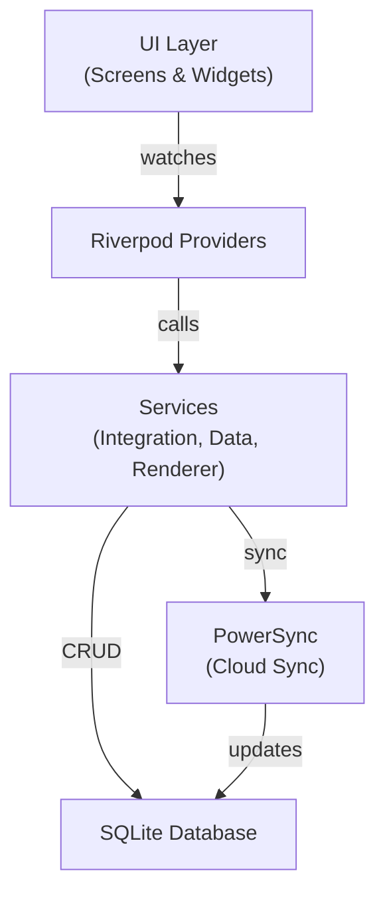

# Project Map - Legacy Flow

> **Last updated:** 2025-12-16

## Overview

Legacy Flow is a **Flutter cross-platform application** that transforms personal photo collections into rich, interactive timelines. It supports multiple visualization modes and uses offline-first architecture with local SQLite storage.

---

## Application Metadata

| Property | Value |
|----------|-------|
| **App Name** | `legacy_flow` |
| **Old Name** | `users_timeline` |
| **Version** | `1.0.0+1` |
| **Flutter Version** | `>=3.10.0` |
| **Dart SDK** | `>=3.0.0 <4.0.0` |
| **State Management** | Riverpod 2.4+ |
| **Database** | SQLite with PowerSync |
| **GitHub** | `https://github.com/Coresick-au/LegacyFlow.git` |

---

## Runtime Entry Points

| Entry Point | Description |
|-------------|-------------|
| [main.dart](file:///c:/Users/Brad/Documents/~AppProjects/TimelineBiographyApp/lib/main.dart) | Application entry point. Initializes sqflite for desktop platforms and runs `UsersTimelineApp` within `ProviderScope`. |
| [app.dart](file:///c:/Users/Brad/Documents/~AppProjects/TimelineBiographyApp/lib/app/app.dart) | Root `MaterialApp` widget. Configures theme, navigation, and loading overlay. |
| [main_navigation.dart](file:///c:/Users/Brad/Documents/~AppProjects/TimelineBiographyApp/lib/app/navigation/main_navigation.dart) | Enhanced navigation with bottom tabs and drawer. |

---

## Build & Run Commands

```bash
# Install dependencies
flutter pub get

# Generate code (models with JSON serialization)
flutter packages pub run build_runner build --delete-conflicting-outputs

# Watch mode for development
flutter packages pub run build_runner watch --delete-conflicting-outputs

# Run the app
flutter run

# Run on web
flutter run -d chrome

# Run all tests
flutter test

# Static analysis
flutter analyze

# Build for production
flutter build apk --release      # Android
flutter build appbundle --release # Android App Bundle
flutter build ios --release       # iOS
flutter build web --release       # Web
```

---

## Environment Variables & Configuration

| Config Location | Purpose |
|-----------------|---------|
| `web/index.html` | Google Maps API key (for map view) |
| `android/app/src/main/AndroidManifest.xml` | Android permissions and API keys |
| `analysis_options.yaml` | Linter rules (uses `flutter_lints`) |
| `pubspec.yaml` | Dependencies and app metadata |
| `build.yaml` | Build runner configuration |

---

## Directory Structure

```
lib/
├── main.dart                     # Entry point
├── app/                          # App-level config
│   ├── app.dart                  # Root MaterialApp
│   └── navigation/               # Navigation system
│       └── main_navigation.dart
├── core/                         # Core utilities
│   ├── database/                 # Database helpers
│   ├── factories/                # Factory patterns
│   ├── notifications/            # Notification system core
│   ├── sync/                     # PowerSync integration
│   ├── templates/                # Template management
│   └── validation/               # Validators
├── features/                     # Feature modules
│   ├── consent/                  # Privacy consent flows
│   ├── dashboard/                # Dashboard widgets & stats
│   ├── demo/                     # Demo/sample data
│   ├── export/                   # Data export (PDF, ZIP, JSON)
│   ├── ghost_camera/             # Photo overlay camera
│   ├── media/                    # Media library
│   ├── notifications/            # Push notifications
│   ├── offline/                  # Offline-first features
│   ├── onboarding/               # Onboarding flow
│   ├── search/                   # Semantic search (FTS5)
│   ├── security/                 # Security & encryption
│   ├── settings/                 # App settings
│   ├── social/                   # Social timeline sharing
│   ├── stories/                  # Rich text stories
│   └── timeline/                 # Core timeline feature
│       ├── interfaces/           # ITimelineRenderer
│       ├── models/               # Timeline-specific models
│       ├── providers/            # Riverpod providers
│       ├── renderers/            # 17 visualization renderers
│       ├── screens/              # Timeline screens
│       ├── services/             # Timeline services
│       ├── views/                # View components
│       └── widgets/              # Timeline widgets
└── shared/                       # Shared components
    ├── database/                 # DB utilities
    ├── design_system/            # Theme, colors, typography
    ├── error_handling/           # Error handling
    ├── export/                   # Export utilities
    ├── intelligence/             # ML/AI features
    ├── loading/                  # Loading widgets
    ├── models/                   # Core data models
    ├── performance/              # Performance monitoring
    ├── providers/                # Shared providers
    └── widgets/                  # Shared widgets
```

---

## Major Modules

### Timeline Visualization System
Location: `lib/features/timeline/renderers/`

| Renderer | File | Description |
|----------|------|-------------|
| Life Stream | `life_stream_timeline_renderer.dart` | Infinite scroll with event cards |
| Enhanced Map | `enhanced_map_timeline_renderer.dart` | Geographic visualization with temporal playback |
| Bento Grid | `bento_grid_timeline_renderer.dart` | Dashboard with statistics |
| Chronological | `chronological_timeline_renderer.dart` | Traditional timeline view |
| Clustered | `clustered_timeline_renderer.dart` | Events grouped by periods |
| Story | `story_timeline_renderer.dart` | Narrative format |
| River | `river_timeline_renderer.dart` | River visualization |
| Swimlanes | `swimlanes_timeline_renderer.dart` | Multi-context swimlanes |
| Flow | `flow_timeline_renderer.dart` | Flow-based rendering |
| Map | `map_timeline_renderer.dart` | Standard map view |

### Core Data Models
Location: `lib/shared/models/`

| Model | Description |
|-------|-------------|
| `TimelineEvent` | Core event with timestamp, location, assets |
| `Context` | Person/Pet/Project context container |
| `Story` | Rich text story with scrollytelling |
| `MediaAsset` | Photo/video/audio asset |
| `GeoLocation` | Geographic coordinates |
| `ExifData` | Image metadata |
| `FuzzyDate` | Imprecise date handling |
| `User` | User profile |
| `Relationship` | User relationships |

### State Management
- **Provider**: `flutter_riverpod` 2.4+
- **Key Providers**: `lib/features/timeline/providers/`
- **Theme Provider**: `lib/shared/providers/theme_provider.dart`

### Services
- **Timeline Integration Service**: Coordinates all timeline features
- **Timeline Data Service**: CRUD operations, sample data
- **Renderer Factory**: Creates appropriate renderers

---

## Data Flow



---

## Platform Support

| Platform | Status | Notes |
|----------|--------|-------|
| Android | ✅ Full | Native SQLite |
| iOS | ✅ Full | Native SQLite |
| Web | ✅ Supported | Map view has fallback UI |
| Windows | ✅ Supported | Uses `sqflite_ffi` |
| macOS | ✅ Supported | Uses `sqflite_ffi` |
| Linux | ✅ Supported | Uses `sqflite_ffi` |

---

## Key Dependencies

| Category | Package | Version |
|----------|---------|---------|
| State | `flutter_riverpod` | ^2.4.9 |
| Database | `sqflite` | ^2.3.0 |
| Maps | `google_maps_flutter` | ^2.5.0 |
| Media | `photo_manager` | ^3.0.0 |
| ML | `google_mlkit_face_detection` | ^0.10.0 |
| Rich Text | `flutter_quill` | ^9.0.0 |
| Animation | `flutter_animate` | ^4.5.0 |
| Sync | `powersync` | ^1.5.0 |

---

## Test Structure

```
test/
├── all_tests.dart               # Test aggregator
├── test_config.dart             # Test configuration
├── test_runner.dart             # Test runner
├── serialization_test.dart      # Model serialization tests
├── template_system_test.dart    # Template tests
├── timeline_visualization_test.dart  # Renderer tests
├── widget_test.dart             # Widget tests
├── integration/                 # Integration tests
├── property_tests/              # 49 property-based tests
└── features/                    # Feature-specific tests
```
